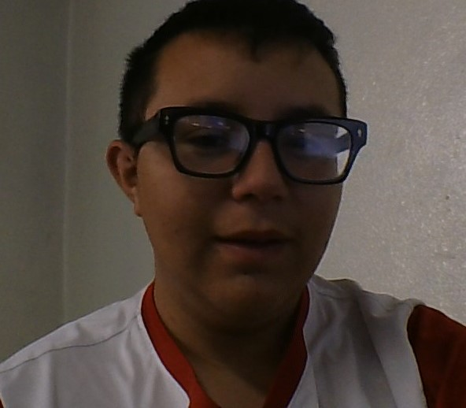

# Documentacion de Aplicacion
1. **Objetivo**
2. **integrantes**
3. **Analisis de la base de datos**

## Objetivo
Desarrollar una aplicación que proporcione herramientas interactivas y fáciles de usar para promover una alimentación saludable. La app ofrecerá información nutricional clara y accesible, permitiendo a los usuarios comprender el valor de los alimentos y tomar decisiones informadas sobre su dieta. Además, se incluirán funciones personalizadas para adaptarse a las necesidades nutricionales individuales, fomentando un estilo de vida saludable a largo plazo.

## integrantes 
**integrante 1**
- **Nombre completo:** Carvajal Bustillos Gael Alan
- **Correo electrónico:** [23308060610312@cetis61.edu.mx]
- **Especialidad:** [Programacion]
- **Institución:** [CETis61]

**integrante 1**
- **Nombre completo:** Mireles Mendez Yesenia
- **Correo electrónico:** [23308060610600@cetis61.edu.mx]
- **Especialidad:** [Programacion]
- **Institución:** [CETis61]

